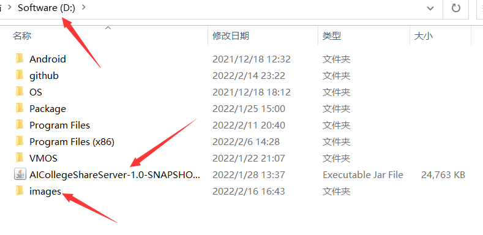
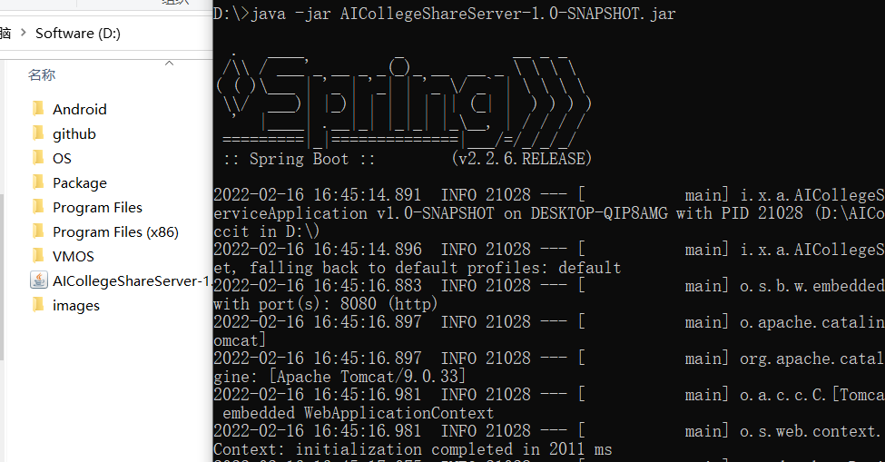
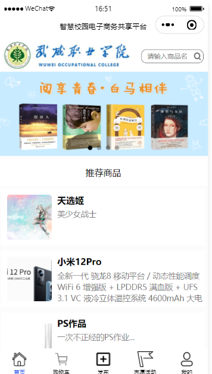
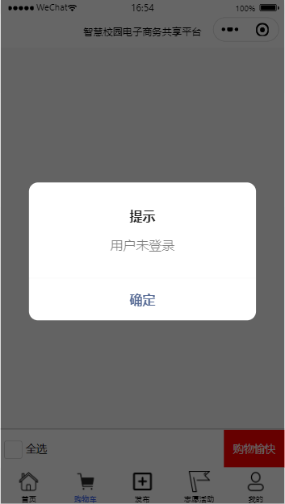
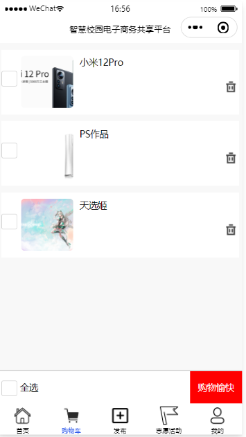
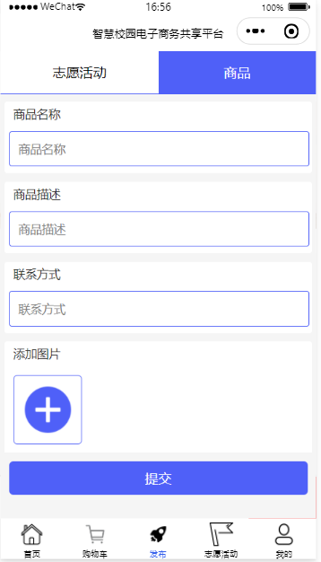
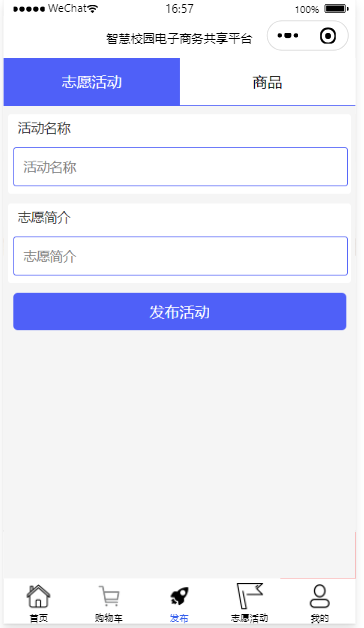
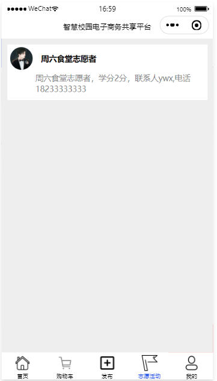
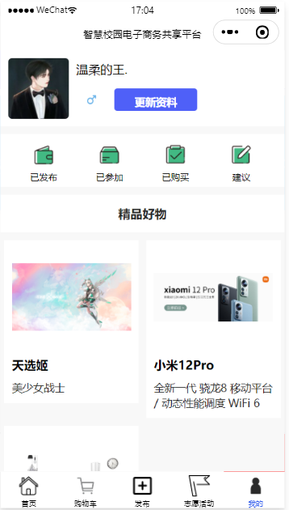

# AICollegeService

#### 介绍
使用微信小程序+SpringBoot开发 数据库使用了MySQL 方便校园二手交易及各种志愿活动发布 

#### 软件架构
* 使用前后端分离架构，前端使用微信小程序，后端使用了近几年大名鼎鼎的**Java微服务**开发框架：SpringBoot

* 数据库选用了关系型数据库**MySQL**

* 开发工具选择：微信开发者工具    Intellij IDEA 
* 主要技术点: **JavaScript**   **WXSS**   **WXML **   **Java**   **SpringBoot**   **SQL**

#### 安装教程

目前项目无法在微信小程序端上线使用，原因是功能不完善，后端必须部署在微信小程序的云服务或者要自备服务器，

所以安装的话，必须在本地部署Java运行环境(Java环境变量)，安装微信开发者工具进行预览

在安装好Java运行环境后，在打包好的jar路径中建立文件夹**images**用来保存上传的图片：



打开命令行工具，使用如下命令在命令行工具中执行:

```powershell
java -jar AICollegeShareServer-1.0-SNAPSHOT.jar
```



#### 使用说明

1. 首页：

   首页在上方展示武威职业学院LOGO 右侧搜索框搜索功能暂未实现

   下方推荐商品是根据商品发布时间进行排序，点击商品会进入商品详情页面:

   

   在此页面中点击加入购物车便会加入到购物车，方便下次查找;点击联系卖家，便会弹出卖家联系方式，所有商品交易都是以线下交易的方式完成，平台不承担任何责任。

2. 购物车:

   如果没有进行登录操作 购物车就会提示你去登录 在登录成功之后会显示自己添加进购物车的商品

   

   这是登录成功之后购物车会展示的页面

3. 发布：

   

   发布页展示如上图所示:上方选择发布商品或者志愿活动，在下方输入框及图片上传位置填入相应信息即可。

   4.志愿活动:

   在此页面会展示已经发布的志愿活动信息。

   5.我的:

   

   次页面可以进行登录、个人资料更新、查看已发布的商品等操作。已参加、已购买、建议等功能暂未实现。

   
